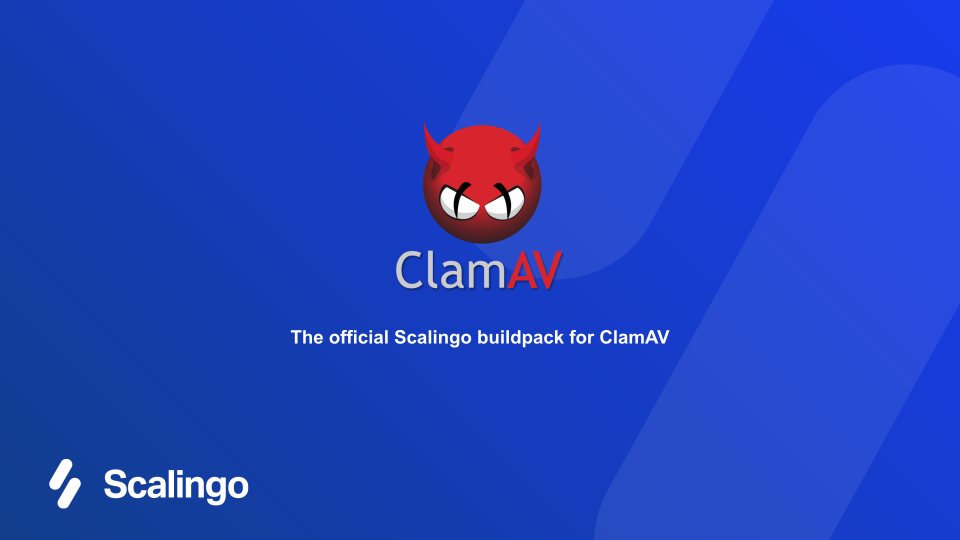

# ClamAV buildpack

This buildpack installs ClamAV into a Scalingo app image.

> :warning: **This buildpack is not meant to be use as a standalone but rather in a
multi-buildpack deployment scenario, along with other softwares** such as nginx
(as front) and clammit (as link between nginx and ClamAV).

## Usage

The following instructions should help you get started:

1. In your project root, create a file named `.buildpacks` with the following
content:

```
https://github.com/Scalingo/clamav-buildpack.git
# Probably more buildpacks here. Otherwise your container won't boot!
```

2. Setup your other buildpacks. Make sure the software(s) interacting with
ClamAV do it through the local unix socket on which clamd is listening
(`/app/run/clamd.sock`).

3. Make sure your start the other processes that will communicate with ClamAV.
   You might need a `Procfile` to do this.

4. Trigger your deployment.

### Deployment workflow

During the build phase, this buildpack:

1. Downloads and installs the `clamav`, `clamav-daemon` and `clamav-freshclam`
   packages.
2. Creates configuration file for `clamd` in`/app/clamav/clamd.conf`.
3. Creates configuration file for `freshclam` in `/app/clamav/freshclam.conf`.
4. Downloads the latest virus database and stores it in the build cache for
   future use.
5. Copies the virus database to the build directory.

:tada: This process results into a scalable image that includes the
configuration, ready to be packaged into a container.

### Behaviour

The default configuration ensures that:

- `clamd` will run in background.
- `clamd` will listen on a local unix socket (`/app/run/clamd.sock`).
- `freshclam` will run in background, checking for updates 12 times a day,
  unless specified otherwise (see [Environment](#environment) below).
- `freshclam` will use the default `database.clamav.net` mirror, unless
  specified otherwise (see [Environment](#environment) below).

### Environment

The following environment variables are available for you to tweak your
deployment:

#### `CLAMD_DATABASE_MIRROR`

ClamAV database mirror to use.\
Defaults to `database.clamav.net`

#### `CLAMD_DISABLE_DAEMON`

When set, this environment variable instructs the image to **NOT** start the
`clamd` daemon.\
Default to being unset

#### `FRESHCLAM_DISABLE_DAEMON`

When set, this environment variable instructs the image to **NOT** start the
`freshclam` daemon.\
Default to being unset

:warning: This is a security risk! Running with an outdated virus database is
pretty useless. You probably don't want to set this, unless you really know
what you do.

:point_right: The virus database is downloaded during the build phase, even
when this environment variable is set.
